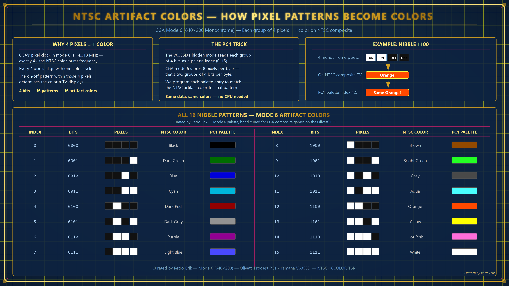

# NTSC 16-Color TSR for Olivetti Prodest PC1

A DOS Terminate-and-Stay-Resident (TSR) program that gives CGA games **16 simultaneous colors** on the Olivetti Prodest PC1, by exploiting the Yamaha V6355D's hidden 160×200×16 graphics mode.

By **Retro Erik** — [YouTube: Retro Hardware and Software](https://www.youtube.com/@RetroErik)


### 📥 [Download PC1-NTSC.COM — the only file you need](PC1-NTSC.COM)

## What It Does

The PC1's V6355D video chip has a 160×200 mode with **16 independently programmable colors** — a mode not exposed by the BIOS. This TSR intercepts CGA video mode changes (modes 4, 5, and 6) and silently activates this hidden mode with custom palettes that simulate NTSC composite artifact colors.

Because the V6355D maps segments B000h and B800h to the **same physical 16KB of VRAM**, games write CGA data that the 16-color display reads directly — no screen copy, no conversion, **zero CPU overhead**.

## How It Works 

### Mode 4/5 (320×200×4 — Standard CGA)

Most DOS games use this mode. Each byte contains 4 pixels at 2 bits each. In the 16-color mode, each nibble represents a pixel-pair combination (left×4 + right), giving 16 possible indices mapped to custom colors.


- Games **designed for composite** (with `/c` or `/c1` switches) use pixel patterns to create blended colors — these look great.
- Games **not designed for composite** still work — solid color areas display correctly, but edges between different colors show color fringing.

### Mode 6 (640×200×2 — CGA Composite Artifact Color)

CGA high-resolution B&W mode. Games using this mode for graphics are **always** using NTSC composite artifact color intentionally. Each nibble = 4 adjacent 1-bit pixels, producing one of 16 NTSC artifact colors documented by [Nerdly Pleasures](https://nerdlypleasures.blogspot.com/2023/03/list-of-ibm-composite-artifact-color.html). This is a faithful simulation of real CGA composite output.



## Palettes

| Key | Palette | Mode | Description |
|-----|---------|------|-------------|
| CTRL+ALT+1 | Mode 4/5 Curated | 4/5 (auto) | **Default for mode 4/5.** Hand-tuned pixel-pair colors for 320×200 games |
| CTRL+ALT+2 | Mode 6 Curated | 6 (auto) | **Default for mode 6.** Hand-tuned NTSC artifact colors for real-game consistency |
| CTRL+ALT+3 | Mode 4/5 Reference | 4/5 | Model-generated New CGA pixel-pair reference (index = left*4 + right) |
| CTRL+ALT+4 | Mode 6 Reference | 6 | Nerdly Pleasures New CGA artifact reference mapping for comparison |

The TSR auto-selects the correct palette when a game sets the video mode. Hotkeys override the selection at any time.

## Screenshots

**Mode 6 — Composite Artifact Colors:**

<p>
<em>Indianapolis 500 (CGA composite /c1)</em><br>

</p>

<p>
<em>Planet X3 (CGA composite mode)</em><br>

</p>

<p>
<em>Police Quest 1 — Intro (CGA composite mode)</em><br>

</p>

<p>
<em>Police Quest 1 (CGA composite mode)</em><br>

</p>

<p>
<em>Police Quest 2 — cga320c.drv — This is the standard CGA driver that shipped with PQ2 SCI. It is not designed for CGA composite — shown here only to illustrate how it looks when not working.</em><br>

</p>

*Using [jhhoward's CGA composite drivers](https://www.vogons.org/viewtopic.php?p=951135&hilit):*

<p>
<em>Police Quest 2 — cgacompo.drv (jhhoward) — Intro</em><br>

</p>

<p>
<em>Police Quest 2 — cgacompo.drv</em><br>

</p>

<p>
<em>King's Quest 1 (CGA composite mode)</em><br>

</p>

<p>
<em>King's Quest 2 (CGA composite mode)</em><br>

</p>

<p>
<em>Leisure Suit Larry (CGA composite mode)</em><br>

</p>

**Mode 4/5 — Enhanced CGA Colors:**

<p>
<em>Ms. Pac-Man</em><br>

</p>

<p>
<em>Lode Runner</em><br>

</p>

<p>
<em>Bruce Lee — Intro</em><br>

</p>

<p>
<em>Bruce Lee</em><br>

</p>

## Confirmed Working Games

**Mode 6 (composite artifact) — Palette 1 (Mode 6 Curated):**
- Indianapolis 500 /c1
- Planet X3 (CGA composite mode)
- Police Quest 2 (CGA composite mode)

**Mode 4/5 (enhanced CGA):**
- Ms. Pac-Man, Zaxxon, Galaxian, Bruce Lee

## Why This Works (Only on the PC1)

Standard CGA cards give you 4 colors from 2-bit pixels — and there's no hardware trick to change that. VGA has plenty of colors but a completely different memory layout (bit planes or linear bytes at A000h), so CGA game data written to B800h can't be reinterpreted.

The Olivetti Prodest PC1's **Yamaha V6355D** video chip is unique because of three hardware features that combine to make this possible:

1. **Hidden 160×200×16 mode** — Writing bit 6 to the mode register (port 0xD8) activates a 4-bit-per-pixel mode with **16 independently programmable RGB colors**. This mode was never exposed by the BIOS.

2. **Memory aliasing** — The V6355D has only 16KB of VRAM and ignores address bit A15. This means segments **B000h** (where the 16-color mode reads) and **B800h** (where CGA games write) map to the **same physical RAM**. Games writing CGA patterns automatically populate the 16-color framebuffer.

3. **Nibble-as-color-index** — In 16-color mode, the V6355D reads each 4-bit nibble from VRAM as a palette index. CGA data naturally forms meaningful nibble patterns: pixel pairs in mode 4 (2bpp) or 4-pixel groups in mode 6 (1bpp). By programming the palette to assign the right color to each pattern, NTSC composite artifact colors emerge — done entirely in hardware, with **zero CPU overhead**.

No other PC-compatible video chipset has this combination. Standard CGA, EGA, and VGA all lack either the memory aliasing, the nibble-indexed mode, or both.

## Technical Details

- **Hardware:** Olivetti Prodest PC1, 8086 @ 8MHz, Yamaha V6355D, 16KB VRAM
- **Unlock value:** Writing 0x4A to port 0xD8 (bit 6) enables the 16-color mode
- **Port aliasing:** 0x3D8 and 0xD8 are the same physical register on the V6355D. Games that write to 0x3D8 can disable the 16-color mode. A timer interrupt (INT 08h) re-writes 0x4A at 18.2 Hz to counteract this.
- **V6355D palette format:** 2 bytes per color — byte 1 = Red (bits 0–2), byte 2 = Green (bits 4–6) | Blue (bits 0–2), values 0–7 per channel
- **CRTC constraint:** Mode 6 games are forced to mode 4 CRTC timing because the V6355D requires the mode register and CRTC character clock to agree

## Usage

```
PC1-NTSC.COM        Install the TSR
PC1-NTSC.COM /U     Uninstall the TSR
```

## License

This project is licensed under the **GNU General Public License v3.0** — see the [LICENSE](LICENSE) file for details.

Copyright (C) 2026 Retro Erik

Once loaded, any game that sets CGA mode 4, 5, or 6 will automatically display in 16 colors. Use CTRL+ALT+1 through CTRL+ALT+4 to switch palettes during gameplay.

## Known Limitations

- **Sierra SCI0 games** (PQ2) that reprogram the CRTC directly for mode 6 timing are incompatible with the forced mode 4 CRTC. A custom Sierra SCI0 video driver is needed for full composite support.
- **Non-composite games** in mode 4/5 will show color fringing at pixel transitions where different CGA colors meet.

## Credits

Created by **Retro Erik**, based on Simone's original concept. NTSC artifact color research based on the [Nerdly Pleasures CGA composite color documentation](https://nerdlypleasures.blogspot.com/2023/03/list-of-ibm-composite-artifact-color.html).

---

## YouTube

For more retro computing content, visit my YouTube channel **Retro Hardware and Software**:
[https://www.youtube.com/@RetroErik](https://www.youtube.com/@RetroErik)
